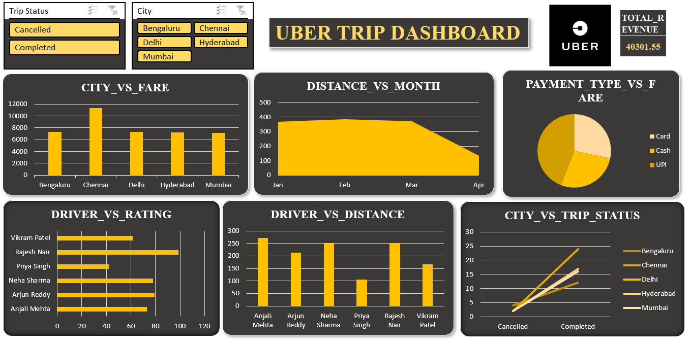

<h1 align="center"> Uber Trip Dashboard (Excel)</h1>

  <b>Microsoft Excel | Data Analysis | Dashboard Visualization</b>

<h2> Introduction</h2>

This project presents an <b>Uber Trip Dashboard</b> built using <b>Microsoft Excel</b> to analyze ride data and extract meaningful insights. 
The dashboard focuses on trip performance, revenue trends, and customer behavior using interactive Excel features.

<h2> Project Objective</h2>

To analyze trip data and create a dynamic dashboard that helps understand ride patterns, track revenue, 
and evaluate operational performance in a ride-sharing environment.

<h2> Dashboard Preview</h2>

  

<h2> Key Metrics</h2>
<ul>
  <li>Total Trips</li>
  <li>Total Revenue</li>
  <li>Average Fare per Trip</li>
  <li>Average Customer Rating</li>
</ul>

<h2> Analysis Performed</h2>
<ul>
  <li>Trip distribution across cities</li>
  <li>Revenue analysis by payment type</li>
  <li>Trip status breakdown (Completed vs Cancelled)</li>
  <li>Distance vs fare relationship</li>
  <li>Customer rating trends</li>
</ul>

<h2> Tools & Techniques Used</h2>
<ul>
  <li><b>Microsoft Excel</b> – Dashboard creation</li>
  <li><b>Pivot Tables</b> – Data summarization</li>
  <li><b>Pivot Charts</b> – Visualization</li>
  <li><b>Data Cleaning</b> – Structured dataset preparation</li>
  <li><b>Formulas</b> – KPI calculations (SUM, AVERAGE, etc.)</li>
</ul>

<h2> Data Description</h2>

The dataset includes the following fields:

<ul>
  <li>Trip ID and Date</li>
  <li>City</li>
  <li>Driver Name</li>
  <li>Distance (km)</li>
  <li>Fare Amount (₹)</li>
  <li>Customer Rating</li>
  <li>Payment Type</li>
  <li>Trip Status</li>
</ul>

<h2> Key Insights</h2>
<ul>
  <li>Completed trips generate the majority of total revenue</li>
  <li>Higher distance trips lead to increased fare values</li>
  <li>Certain cities show higher ride demand</li>
  <li>Customer ratings help evaluate service quality</li>
</ul>

<h2> Dashboard Features</h2>
<ul>
  <li>Interactive filters using slicers</li>
  <li>KPI cards for quick insights</li>
  <li>Dynamic charts for trend analysis</li>
  <li>Clean and user-friendly layout</li>
</ul>

<h2> How to Use</h2>
<ol>
  <li>Download the Excel file from this repository</li>
  <li>Open it using <b>Microsoft Excel</b></li>
  <li>Use slicers and filters to explore insights</li>
</ol>

<h2> Project Structure</h2>
<pre>
uber-trip-dashboard
│── uber trip dashboard.xlsx
│── Images/
│   ├── uber_dashboard.png
│── README.md
</pre>

<i>Note: Dataset is included within the Excel file.</i>

<h2> Author</h2>

<b>Anjana C</b> 
Aspiring Data Analyst | Passionate about data-driven decision making

⭐ If you found this project useful, consider giving it a star!

